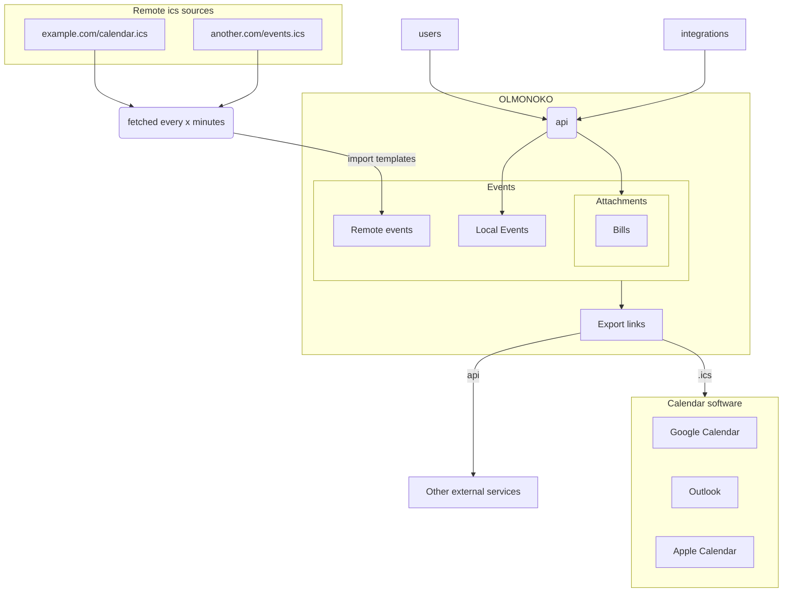

# OLMONOKO

> [!NOTE]
> Still wery much work-in-progress, see [TODO.md](olmonoko-backend/TODO.md) for a list of planned features.
> 
> The current frontend is intended to be a placeholder and there is no complete api yet.

